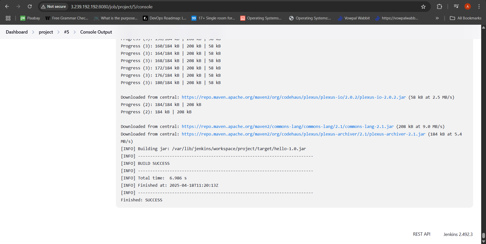

# Task 8 - Java Maven Build with Jenkins

This project demonstrates a simple CI/CD setup using Jenkins and Maven to build a basic Java HelloWorld application.

## Project Structure
- Java source file: `src/main/java/HelloWorld.java`
- Maven config: `pom.xml`

## Jenkins Job Setup
- Type: Freestyle Project
- Source Code: GitHub repo
- Build Tool: Maven (goal: `clean package`)
- Output: `BUILD SUCCESS`

## Output Screenshot

